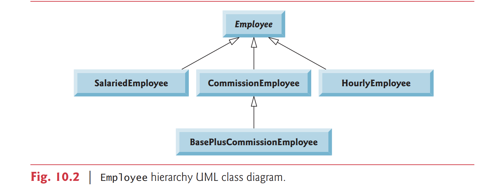

# 10.5 Case Study: Payroll System Using Polymorphism

This section reexamines the CommissionEmployee-BasePlusCommissionEmployee hierarchy that we explored throughout Section 9.4.

Now we use an abstract method and polymorphism to perform payroll calculations based on an enhanced employee inheritance
hierarchy that meets the following requirements:

A company pays its employees on a weekly basis. The employees are of four types: Salaried
employees are paid a fixed weekly salary regardless of the number of hours worked, hourly
employees are paid by the hour and receive overtime pay (i.e., 1.5 times their hourly salary rate) for all hours worked in excess of 40 hours, commission employees are paid a percentage of their sales and base-salaried commission employees receive a base salary plus a
percentage of their sales. For the current pay period, the company has decided to reward
salaried-commission employees by adding 10% to their base salaries. The company
wants you to write an application that performs its payroll calculations polymorphically

We use abstract class `Employee` to represent the general concept of an employee. The
classes that extend `Employee` are `SalariedEmployee`, `CommissionEmployee` and `HourlyEmployee`. Class `BasePlusCommissionEmployee` — which extends `CommissionEmployee` —
represents the last employee type. The UML class diagram in Fig. 10.2 shows the inheritance hierarchy for our polymorphic employee-payroll application. Abstract class name
Employee is italicized—a convention of the UML.



Abstract superclass Employee declares the “interface” to the hierarchy—that is, the set
of methods that a program can invoke on all Employee objects.

-   “interface” : the set
    of methods that a program can invoke on all Employee objects.

We use the term “interface”
here in a general sense to refer to the various ways programs can communicate with objects
of any Employee subclass.

Be careful not to confuse the general notion of an “interface”
with the formal notion of a Java interface, the subject of Section 10.9.

Each employee,
regardless of the way his or her earnings are calculated, has a first name, a last name and a
social security number, so `private` instance variables `firstName`, `lastName` and `socialSecurityNumber` appear in abstract superclass `Employee`.

The diagram in Fig. 10.3 shows each of the five classes in the hierarchy down the left
side and methods `earnings` and `toString` across the top.

For each class, the diagram
shows the desired results of each method.

We do not list superclass Employee’s get methods
because they’re not overridden in any of the subclasses — each of these methods is inherited
and used “as is” by each subclass.


The following sections implement the Employee class hierarchy of Fig. 10.2.

The first
section implements abstract superclass Employee.

The next four sections each implement
one of the concrete classes.

The last section implements a test program that builds objects
of all these classes and processes those objects polymorphically.

## 10.5.1 Abstract Superclass Employee

Class `Employee` (Fig. 10.4) provides methods `earnings` and `toString`, in addition to the
get methods that return the values of Employee’s instance variables.

An earnings method
certainly applies generically to all employees.

But each earnings calculation depends on the
employee’s particular class.

So we declare earnings as abstract in superclass Employee
because a specific default implementation does not make sense for that method—there isn’t
enough information to determine what amount earnings should return.

Each subclass overrides earnings with an appropriate implementation.

To calculate an
employee’s earnings, the program assigns to a superclass Employee variable a reference to the
employee’s object, then invokes the earnings method on that variable.

-   To calculate an employee’s earnings
-   the program assigns to a superclass Employee variable
-   a reference to the employee’s object
    -   then invokes the earnings method on that variable

We maintain an
array of `Employee` variables, each holding a reference to an `Employee` object.

-   an array of `Employee` variables
    -   each holding **a reference** to an `Employee` object

You cannot use
class `Employee` directly to create `Employee` objects,because `Employee` is an abstract class.

-   **You cannot use class `Employee` directly to create `Employee` objects,because `Employee` is an `abstract` class**

Due to inheritance, however, all objects of all Employee subclasses may be thought of as Employee objects.

The program will iterate through the array and call method earnings for each
`Employee` object.

Java processes these method calls polymorphically.

Declaring earnings as
an `abstract` method in `Employee` enables the calls to earnings through `Employee` variables
to compile and forces every direct concrete subclass of `Employee` to override earnings.

Method `toString` in class `Employee` returns a `String` containing the first name, last
name and social security number of the employee.

As we’ll see, each subclass of Employee
overrides method `toString` to create a String representation of an object of that class that
contains the employee’s type (e.g., "salaried employee:") followed by the rest of the
employee’s information.

Let’s consider class `Employee`’s declaration (Fig. 10.4). The class includes a constructor that receives the first name, last name and social security number (lines 11–17);
get methods that return the first name, last name and social security number (lines 20–23,
26–29 and 32–35, respectively); method `toString` (lines 38–43), which returns the
String representation of an Employee; and `abstract` method earnings (line 46), which
will be implemented by each of the concrete subclasses.

The Employee constructor does not
validate its parameters in this example; normally, such validation should be provided.

```java
// Fig. 10.4: Employee.java
// Employee abstract superclass.
public abstract class Employee {
    private final String firstName;
    private final String lastName;
    private final String socialSecurityNumber;

    // constructor
    public Employee(String firstName, String lastName,
                    String socialSecurityNumber) {
        this.firstName = firstName;
        this.lastName = lastName;
        this.socialSecurityNumber = socialSecurityNumber;
    }

    // return first name
    public String getFirstName() {
        return firstName;
    }

    // return last name
    public String getLastName() {
        return lastName;
    }

    // return social security number
    public String getSocialSecurityNumber() {
        return socialSecurityNumber;
    }

    // return String representation of Employee object
    @Override
    public String toString() {
        return String.format("%s %s%nsocial security number: %s",
                getFirstName(), getLastName(), getSocialSecurityNumber());
    }

    // abstract method must be overridden by concrete subclasses
    public abstract double earnings(); // no implementation here

} // end abstract class Employee
```

Why did we decide to declare earnings as an abstract method?

It simply does not
make sense to provide a specific implementation of this method in class `Employee`.

We
cannot calculate the earnings for a general Employee—we first must know the specific type
of Employee to determine the appropriate earnings calculation.

-   employee 太多了
-   所以要細分哪一種 employee 的 earning

By declaring this method
abstract, we indicate that each concrete subclass must provide an appropriate earnings
implementation and that a program will be able to use superclass `Employee` variables to
invoke method earnings polymorphically for any type of `Employee`.

## 10.5.2 Concrete Subclass SalariedEmployee

Class `SalariedEmployee` (Fig. 10.5) extends class `Employee` (line 4) and overrides `abstract`
method `earnings` (lines 38–42), which makes `SalariedEmployee` a concrete class.

```java
public class SalariedEmployee extends Employee
```

```java
    // calculate earnings; override abstract method earnings in Employee
    @Override
    public double earnings() {
        return getWeeklySalary();
    }
```

```java
    // return String representation of SalariedEmployee object
    @Override
    public String toString() {
        return String.format("salaried employee: %s%n%s: $%,.2f",
                super.toString(), "weekly salary", getWeeklySalary());
    }
```

The class
includes a constructor (lines 9–19) that receives a first name, a last name, a social security
number and a weekly salary; a set method to assign a new nonnegative value to instance variable weeklySalary (lines 22–29); a get method to return weeklySalary’s value (lines 32–
35); a method earnings (lines 38–42) to calculate a SalariedEmployee’s earnings; and a
method toString (lines 45–50), which returns a String including "salaried employee: "
followed by employee-specific information produced by superclass Employee’s `toString`
method and Salaried-Employee’s `getWeeklySalary` method.

Class SalariedEmployee’s
constructor passes the first name, last name and social security number to the Employee constructor (line 12) to initialize the private instance variables of the superclass.

```java
super(firstName, lastName,socialSecurityNumber);
```

-   subclass passes first name, last name and social security number to the super class's constructor
-   to initialize the private instance variables of the superclass

Once again,
we’ve duplicated the `weeklySalary` validation code in the constructor and the `setWeeklySalary` method.

Recall that more complex validation could be placed in a `static` class method that’s called from the constructor and the set method.

### Error-Prevention Tip 10.1

We’ve said that you should **not call a class’s instance methods from its constructors** — **you can call static class methods and make the required call to one of the superclass’s constructors.** If you follow this advice, you’ll avoid the problem of calling the class’s overridable methods either directly or indirectly, which can lead to runtime errors

Method `earnings` overrides Employee’s `abstract` method `earnings` to provide a concrete implementation that returns the `SalariedEmployee`’s weekly salary. If we do not implement `earnings`, class `SalariedEmployee` must be declared **abstract** —otherwise,
class `SalariedEmployee` will not compile.

-   abstract earnings --> must implementation or declare another abstract earnings

Of course, we want `SalariedEmployee` to be a
concrete class in this example.

Method `toString` (lines 45–50) overrides Employee method `toString`.

If class `SalariedEmployee` did not override `toString`, `SalariedEmployee` would have inherited the
Employee version of `toString`.

In that case, `SalariedEmployee`’s `toString` method would
simply return the employee’s full name and social security number, which does not adequately represent a `SalariedEmployee`.

To produce a complete String representation of a
`SalariedEmployee`, the subclass’s `toString` method returns "salaried employee: " followed by the superclass Employee-specific information (i.e., first name, last name and social
security number) obtained by invoking the superclass’s `toString` method (line 49)—this is a
nice example of code reuse.

```java
super.toString()
```

The String representation of a `SalariedEmployee` also contains
the employee’s weekly salary obtained by invoking the class’s `getWeeklySalary` method.

### 10.5.3 Concrete Subclass HourlyEmployee

Class `HourlyEmployee` (Fig. 10.6) also extends `Employee` (line 4). 

```java
public class HourlyEmployee extends Employee {
```

The class includes a constructor (lines 10–25) that receives a first name, a last name, a social security number, an
hourly wage and the number of hours worked.

```java
    // constructor
    public HourlyEmployee(String firstName, String lastName,
                          String socialSecurityNumber, double wage, double hours) {
        super(firstName, lastName, socialSecurityNumber);
        if (wage < 0.0) // validate wage
            throw new IllegalArgumentException(
                    "Hourly wage must be >= 0.0");
        if ((hours < 0.0) || (hours > 168.0)) // validate hours
            throw new IllegalArgumentException(
                    "Hours worked must be >= 0.0 and <= 168.0");
        this.wage = wage;
        this.hours = hours;
    }
```

Lines 28–35 and 44–51 declare set methods
that assign new values to instance variables wage and hours, respectively.

Method `setWage`
(lines 28–35) ensures that wage is nonnegative, and method `setHours` (lines 44–51) ensures
that the value of hours is between 0 and 168 (the total number of hours in a week) inclusive.

Class `HourlyEmployee` also includes get methods (lines 38–41 and 54–57) to return the values of wage and hours, respectively; a method earnings (lines 60–67) to calculate an `HourlyEmployee`’s earnings; and a method `toString` (lines 70–76), which returns a String
containing the employee’s type ("hourly employee: ") and the employee-specific information. The `HourlyEmployee` constructor, like the `SalariedEmployee` constructor, passes the
first name, last name and social security number to the superclass Employee constructor
(line 13) to initialize the private instance variables.

In addition, method `toString` calls superclass method `toString` (line 74) to obtain the Employee-specific information (i.e., first
name, last name and social security number)—this is another nice example of code reuse.

```java
// Fig. 10.6: HourlyEmployee.java
// HourlyEmployee class extends Employee.
public class HourlyEmployee extends Employee {
    private double wage; // wage per hour
    private double hours; // hours worked for week

    // constructor
    public HourlyEmployee(String firstName, String lastName,
                          String socialSecurityNumber, double wage, double hours) {
        super(firstName, lastName, socialSecurityNumber);
        if (wage < 0.0) // validate wage
            throw new IllegalArgumentException(
                    "Hourly wage must be >= 0.0");
        if ((hours < 0.0) || (hours > 168.0)) // validate hours
            throw new IllegalArgumentException(
                    "Hours worked must be >= 0.0 and <= 168.0");
        this.wage = wage;
        this.hours = hours;
    }

    // set wage
    public void setWage(double wage) {
        if (wage < 0.0) // validate wage
            throw new IllegalArgumentException(
                    "Hourly wage must be >= 0.0");
        this.wage = wage;
    }

    // return wage
    public double getWage() {
        return wage;
    }

    // set hours worked
    public void setHours(double hours) {
        if ((hours < 0.0) || (hours > 168.0)) // validate hours
            throw new IllegalArgumentException(
                    "Hours worked must be >= 0.0 and <= 168.0");
        this.hours = hours;
    }

    // return hours worked
    public double getHours() {
        return hours;
    }// calculate earnings; override abstract method earnings in Employee

    @Override
    public double earnings() {
        if (getHours() <= 40) // no overtime
            return getWage() * getHours();
        else
            return 40 * getWage() + (getHours() - 40) * getWage() * 1.5;
    }// return String representation of HourlyEmployee object

    @Override
    public String toString() {
        return String.format("hourly employee: %s%n%s: $%,.2f; %s: %,.2f",
                super.toString(), "hourly wage", getWage(),
                "hours worked", getHours());
    }

} // end class HourlyEmployee
```

### 10.5.4 Concrete Subclass CommissionEmployee

Class `CommissionEmployee` (Fig. 10.7) extends class `Employee` (line 4). 
The class includes a
constructor (lines 10–25) that takes a first name, a last name, a social security number, a sales
amount and a commission rate; set methods (lines 28–34 and 43–50) to assign valid new values to instance variables commissionRate and grossSales, respectively; get methods (lines
37–40 and 53–56) that retrieve the values of these instance variables; method earnings
(lines 59–63) to calculate a CommissionEmployee’s earnings; and method toString (lines
66–73), which returns the employee’s type, namely, "commission employee: " and employee-specific information. The constructor also passes the first name, last name and social security number to superclass Employee’s constructor (line 14) to initialize Employee’s private
instance variables. Method `toString` calls superclass method `toString` (line 70) to obtain the
Employee-specific information (i.e., first name, last name and social security number).

```java
// Fig. 10.7: CommissionEmployee.java
// CommissionEmployee class extends Employee.
public class CommissionEmployee extends Employee {
    private double grossSales; // gross weekly sales
    private double commissionRate; // commission percentage

    // constructor
    public CommissionEmployee(String firstName, String lastName,
                              String socialSecurityNumber, double grossSales,
                              double commissionRate) {
        super(firstName, lastName, socialSecurityNumber);
        if (commissionRate <= 0.0 || commissionRate >= 1.0) // validate
            throw new IllegalArgumentException(
                    "Commission rate must be > 0.0 and < 1.0");
        if (grossSales < 0.0) // validate
            throw new IllegalArgumentException("Gross sales must be >= 0.0");
        this.grossSales = grossSales;
        this.commissionRate = commissionRate;
    }

    // set gross sales amount
    public void setGrossSales(double grossSales) {
        if (grossSales < 0.0) // validate
            throw new IllegalArgumentException("Gross sales must be >= 0.0");
        this.grossSales = grossSales;
    }

    // return gross sales amount
    public double getGrossSales() {
        return grossSales;
    }

    // set commission rate
    public void setCommissionRate(double commissionRate) {
        if (commissionRate <= 0.0 || commissionRate >= 1.0) // validate
            throw new IllegalArgumentException(
                    "Commission rate must be > 0.0 and < 1.0");
        this.commissionRate = commissionRate;
    }

    // return commission rate
    public double getCommissionRate() {
        return commissionRate;
    }// calculate earnings; override abstract method earnings in Employee

    @Override
    public double earnings() {
        return getCommissionRate() * getGrossSales();
    }// return String representation of CommissionEmployee object

    @Override
    public String toString() {
        return String.format("%s: %s%n%s: $%,.2f; %s: %.2f",
                "commission employee", super.toString(),
                "gross sales", getGrossSales(),
                "commission rate", getCommissionRate());
    }

} // end class CommissionEmployee
```

## 10.5.5 Indirect Concrete Subclass BasePlusCommissionEmployee

Class `BasePlusCommissionEmployee` (Fig. 10.8) extends class `CommissionEmployee` (line 4) and therefore is an **indirect subclass** of class `Employee`. 

```java
public class BasePlusCommissionEmployee extends CommissionEmployee
```

Class `BasePlusCommissionEmployee` has a constructor (lines 9–20) that receives a first name, a last name, a social security number, a sales amount, a commission rate and a base salary. 

-   constructor 的 super 是 `CommissionEmployee` 的 variable name

```java
    // constructor
    public CommissionEmployee(String firstName, String lastName,
                              String socialSecurityNumber, double grossSales,
                              double commissionRate) {
        super(firstName, lastName, socialSecurityNumber);
        if (commissionRate <= 0.0 || commissionRate >= 1.0) // validate
            throw new IllegalArgumentException(
                    "Commission rate must be > 0.0 and < 1.0");
        if (grossSales < 0.0) // validate
            throw new IllegalArgumentException("Gross sales must be >= 0.0");
        this.grossSales = grossSales;
        this.commissionRate = commissionRate;
    }
```

It then passes all of these except the base salary to the `CommissionEmployee` constructor (lines 13–14) to initialize the superclass instance variables. 

-   除了 baseSalary 之外, 全部 pass 給 `CommissionEmployee` 去 initialize the instance variables

`BasePlusCommissionEmployee` also contains a set method (lines 23–29) to assign a new value to instance variable `baseSalary` and a get method (lines 32–35) to return `baseSalary`’s value. 

Method `earnings` (lines 38–42) calculates a `BasePlusCommissionEmployee`’s earnings. 

```java
    @Override
    public double earnings() {
        return getCommissionRate() * getGrossSales();
    }// return String representation of CommissionEmployee object
```

Line 41 in method `earnings` calls superclass `CommissionEmployee`’s earnings method to calculate the commission-based
portion of the employee’s earnings—this is another nice example of code reuse.

```java
return getCommissionRate() * getGrossSales();
```

-   這一行是 call `CommissionEmployee` 的 `earnings`

`BasePlusCommissionEmployee`’s `toString` method (lines 45–51) creates a String representation of a `BasePlusCommissionEmployee` that contains "base-salaried", followed by the String obtained by invoking superclass `CommissionEmployee`’s `toString` method (line 49), then the base salary. 

-   `super.toString()` 是 call `CommissionEmployee` `toString`

```java
    @Override
    public String toString() {
        return String.format("%s: %s%n%s: $%,.2f; %s: %.2f",
                "commission employee", super.toString(),
                "gross sales", getGrossSales(),
                "commission rate", getCommissionRate());
    }
```

The result is a String beginning with "base-salaried commission employee" followed by the rest of the `BasePlusCommissionEmployee`’s information.
Recall that `CommissionEmployee`’s toString obtains the employee’s first name, last name
and social security number by invoking the `toString` method of its superclass (i.e., Employee)—yet another example of code reuse. 

`BasePlusCommissionEmployee`’s `toString` initiates a chain of method calls that span all three levels of the Employee hierarchy.


## 10.5.6 Polymorphic Processing, Operator instanceof and Downcasting
To test our `Employee` hierarchy, the application in Fig. 10.9 creates an object of each of the
four concrete classes `SalariedEmployee`, `HourlyEmployee`, `CommissionEmployee` and `BasePlusCommissionEmployee`. 

The program manipulates these objects nonpolymorphically, via
variables of each object’s own type, then polymorphically, using an array of Employee variables. 

While processing the objects polymorphically, the program increases the base salary
of each `BasePlusCommissionEmployee` by 10%—this requires determining the object’s type
at execution time. 


Finally, the program polymorphically determines and outputs the type of
each object in the Employee array. 

Lines 9–18 create objects of each of the four concrete
`Employee` subclasses. 

- create 4 個 `Employee` 的 subclasses

```java
// create subclass objects
SalariedEmployee salariedEmployee =
new SalariedEmployee("John", "Smith", "111-11-1111", 800.00);
HourlyEmployee hourlyEmployee =
new HourlyEmployee("Karen", "Price", "222-22-2222", 16.75, 40);
CommissionEmployee commissionEmployee =
new CommissionEmployee(
"Sue", "Jones", "333-33-3333", 10000, .06);
BasePlusCommissionEmployee basePlusCommissionEmployee =
new BasePlusCommissionEmployee(
"Bob", "Lewis", "444-44-4444", 5000, .04, 300);
```

Lines 22–30 output the String representation and earnings of each
of these objects nonpolymorphically. 

```java
        System.out.println("salariedEmployee : " + salariedEmployee.earnings());
        System.out.println("hourlyEmployee : " + hourlyEmployee.earnings());
        System.out.println("commissionEmployee : " + commissionEmployee.earnings());
        System.out.println("basePlusCommissionEmployee : " + basePlusCommissionEmployee.earnings());
```


Each object’s `toString` method is called implicitly by
`printf` when the object is output as a String with the `%s` format specifier.

- 當 `%s` 被 寫在 printf 裡面時, 其實 `toString` method 已經被使用了

### Creating the Array of Employees

Line 33 declares employees and assigns it an array of four `Employee` variables. 

```java
// create four-element Employee array
Employee[] employees = new Employee[4];
```
- employees 的 declaration

Line 36 assigns to `employees[0]` a reference to a `SalariedEmployee` object. 

Line 37 assigns to
`employees[1]` a reference to an `HourlyEmployee` object. 

Line 38 assigns to `employees[2]`
a reference to a `CommissionEmployee` object. 

Line 39 assigns to `employee[3]` a reference
to a `BasePlusCommissionEmployee` object. 

```java
        employees[0] = salariedEmployee;
        employees[1] = hourlyEmployee;
        employees[2] = commissionEmployee;
        employees[3] = basePlusCommissionEmployee;
```

These assignments are allowed, because a `SalariedEmployee` is an `Employee`, an `HourlyEmployee` is an `Employee`, a `CommissionEmployee` is an `Employee` and a `BasePlusCommissionEmployee` is an `Employee`. 

- 這些 assignment 是可行的因為這 4 個都是 `Employee` 的 subclasses

Therefore, we can
assign the references of `SalariedEmployee`, `HourlyEmployee`, `CommissionEmployee` and
`BasePlusCommissionEmployee` objects to superclass Employee variables, even though Employee is an abstract class.

- 所以我們可以 assign 這 4 個人家的地址(memory location) 到 `Employee` array 裡面


### Polymorphically Processing Employees
Lines 44–65 iterate through array `employees` and invoke methods `toString` and `earnings` with `Employee` variable `currentEmployee`, which is assigned the reference to a different `Employee` in the array on each iteration. 


- 使用 enhanced for 去 loop through employees array, data type 是 Employee 這一個 abstract class(parent class), `currentEmployee` 裡面有 `salariedEmployee`, `hourlyEmployee`, `commissionEmployee`, `basePlusCommissionEmployee`


```java
        for (Employee currentEmployee : employees) {
            // invoke toString()
            System.out.println(currentEmployee);
            // 如果 currentEmployee 的 data type 是 BasePlusCommissionEmployee
            if (currentEmployee instanceof BasePlusCommissionEmployee) {
                // 因為目前 currentEmployee 的 data type 是 Employee,  所以要降轉變為 BasePlusCommissionEmployee
                BasePlusCommissionEmployee employee = (BasePlusCommissionEmployee) currentEmployee;
                employee.setBaseSalary(1.1 * employee.getBaseSalary());
                System.out.println("new base employee salary is: " + employee.getBaseSalary());
            }
            // invoke earning method based on their data type
            System.out.println(currentEmployee.earnings());
        }
```

The output illustrates that the specific methods for each class are indeed invoked. 


All calls to method ``toString`` and `earnings` are resolved at execution time, based on the type of the object to which `currentEmployee` refers. 

- `toString` 和 `earnings` 發生的時候是在 execution time, 而且這 2 個方法會根據 `currentEmployee` 的 data type 做判斷


This process is known as dynamic binding or late binding. 

- 這種叫做 dynamic binding or late binding

For example, line 46 implicitly invokes method `toString` of the object to which `currentEmployee` refers. 

- println 會 invoke toString method, 那是由哪一個 class 所執行toString method 呢? 會根據reference 當時的 data type

```java
System.out.println(currentEmployee); // invokes toString
```

As a result of dynamic binding, Java decides which class’s `toString` method to call at execution time rather than at compile time. 

Only the methods of class `Employee` can be called via an
`Employee` variable (and `Employee`, of course, includes the methods of class `Object`). 


A superclass reference can be used to invoke only methods of the superclass—the subclass method implementations are invoked polymorphically.

- dynamic binding 只會發生在 method 可以 override 身上, 如果 method 是 private, static, final 就會是 static(early) binding, 因為 private, static, final method 不可以被 override
- 這一個例子來說因為 parent class 的 walk() 是 static, 不可以被 override, 表示 child 的 walk 跟 Human 的 walk 是不相關的, 所以要呼叫 Boy 的 walk 就要用 Boy data type 才可以

```java
class Human{
   public static void walk()
   {
       System.out.println("Human walks");
   }
}
class Boy extends Human{
   public static void walk(){
       System.out.println("Boy walks");
   }
   public static void main( String args\[]) {
    //    /_ Reference is of Human type and object is
    //     _ Boy type
    //     _/
       Human obj = new Boy();
    //    /_ Reference is of HUman type and object is
    //     _ of Human type.
    //     _/
       Human obj2 = new Human();
       Boy obj3 = new Boy();

    // 因為 method 是 static, 所以看 variable name 的 data type 就決定
       obj.walk(); // Human walks
       obj2.walk(); // Human walks
       obj3.walk(); // Boy walks
   }
}
```

```java
class Human{
   //Overridden Method
   public void walk()
   {
       System.out.println("Human walks");
   }
}
class Demo extends Human{
   //Overriding Method
   public void walk(){
       System.out.println("Boy walks");
   }
   public static void main( String args\[]) {
    //    /_ Reference is of Human type and object is
    //     _ Boy type
    //     _/
       Human obj = new Demo();
    //    /_ Reference is of HUman type and object is
    //     _ of Human type.
    //     _/
       Human obj2 = new Human();
       // 當 method 被 call 的時候是看 new 後面的 data type 所決定
       obj.walk();
       obj2.walk();
   }
}
```

### Performing Type-Specific Operations on BasePlusCommissionEmployees
We perform special processing on `BasePlusCommissionEmployee` objects—as we encounter these objects at execution time, we increase their base salary by 10%. 

When processing
objects polymorphically, we typically do not need to worry about the specifics, but to adjust
the base salary, we do have to determine the specific type of Employee object at execution
time. 


Line 49 uses the `instanceof` operator to determine whether a particular `Employee`
object’s type is `BasePlusCommissionEmployee`. 

```java
if (currentEmployee instanceof BasePlusCommissionEmployee)
```


The condition in line 49 is true if the object referenced by `currentEmployee` is a `BasePlusCommissionEmployee`. 


This would also
be true for any object of a `BasePlusCommissionEmployee` subclass because of the is-a relationship a subclass has with its superclass. 

- 如果放 BasePlusCommissionEmployee 的 subclass 也會是 true

Lines 53–54 downcast `currentEmployee` from
type `Employee` to type `BasePlusCommissionEmployee` — this cast is allowed only if the object has an is-a relationship with `BasePlusCommissionEmployee`. 

有繼承關係的才可以這樣降轉

```java
BasePlusCommissionEmployee employee = (BasePlusCommissionEmployee) currentEmployee;
```

The condition at line 49
ensures that this is the case. 


This cast is required if we’re to invoke subclass `BasePlusCommissionEmployee` methods `getBaseSalary` and `setBaseSalary` on the current `Employee`
object—as you’ll see momentarily, attempting to invoke a subclass-only method directly on a superclass reference is a compilation error.

- 如果用 superclass invoke subclass 的 method 會發生 compilation error, 雖然這裡的 `getBaseSalary` `setBaseSalary` 是 public, 但是 2 個 method 都只在 subclass 才寫的


### Common Programming Error 10.3
Assigning a superclass variable to a subclass variable is a compilation error.


### Common Programming Error 10.4
When downcasting a reference, a ClassCastException occurs if the referenced object at execution time does not have an is-a relationship with the type specified in the cast operator.


If the instanceof expression in line 49 is true, lines 53–60 perform the special processing required for the `BasePlusCommissionEmployee` object. Using `BasePlusCommissionEmployee` variable employee, line 56 invokes subclass-only methods `getBaseSalary`
and `setBaseSalary` to retrieve and update the employee’s base salary with the 10% raise.


### Calling earnings Polymorphically
Lines 63–64 invoke method `earnings` on `currentEmployee`, which polymorphically calls
the appropriate subclass object’s earnings method.

Obtaining the `earnings` of the `SalariedEmployee`, `HourlyEmployee` and `CommissionEmployee` polymorphically in lines 63–
64 produces the same results as obtaining these employees’ earnings individually in lines 22–27. 

```java
System.out.printf(
"earned $%,.2f%n%n", currentEmployee.earnings()
);
```

- 上下 2 段 code 是完全一樣的

```java
System.out.printf("%n%s%n%s: $%,.2f%n%n",
salariedEmployee, "earned", salariedEmployee.earnings());
System.out.printf("%s%n%s: $%,.2f%n%n",
hourlyEmployee, "earned", hourlyEmployee.earnings());
System.out.printf("%s%n%s: $%,.2f%n%n",
commissionEmployee, "earned", commissionEmployee.earnings());
System.out.printf("%s%n%s: $%,.2f%n%n",
basePlusCommissionEmployee,
"earned", basePlusCommissionEmployee.earnings());
```

The earnings amount obtained for the `BasePlusCommissionEmployee` in lines 63 – 64 is higher than that obtained in lines 28–30, due to the 10% increase in its base salary.

### Getting Each Employee’s Class Name
Lines 68–70 display each employee’s type as a `String`. 

```java
// get type name of each object in employees array
for (int j = 0; j &lt; employees.length; j++)
System.out.printf("Employee %d is a %s%n", j, employees[j].getClass().getName());
```

Every object knows its own class and
can access this information through the `getClass` method, which all classes inherit from
class `Object`. 

- getClass 是 Object 的東西

```
Returns the runtime class of this Object. The returned Class object is the object that is locked by static synchronized methods of the represented class.
```

Method `getClass` returns an object of type `Class` (from package java.lang), which contains information about the object’s type, including its class name.


Line 70 invokes `getClass` on the current object to get its class. The result of the `getClass` call is used to invoke `getName` to get the object’s class name.

```java
employees[j].getClass().getName());
```


### Avoiding Compilation Errors with Downcasting
In the previous example, we avoided several compilation errors by downcasting an Employee variable to a `BasePlusCommissionEmployee` variable in lines 53–54. 


If you remove the
cast operator (`BasePlusCommissionEmployee`) from line 54 and attempt to assign Employee variable currentEmployee directly to `BasePlusCommissionEmployee` variable employee, you’ll receive an “incompatible types” compilation error. 


This error indicates
that the attempt to assign the reference of superclass object `currentEmployee` to subclass
variable employee is not allowed. 


The compiler prevents this assignment because a `CommissionEmployee` is not a `BasePlusCommissionEmployee` — the is-a relationship applies only
between the subclass and its superclasses, not vice versa.

- 因為 subclass is a superclass 所以 subclass 可以使用 superclass 的東西, 但是反過來就不行, 就跟人類是哺乳類但是哺乳類的不一定都是人類


Similarly, if lines 56 and 60 used superclass variable `currentEmployee` to invoke subclass-only methods `getBaseSalary` and `setBaseSalary`, we’d receive “cannot find symbol” compilation errors at these lines. 


Attempting to invoke subclass-only methods via
a superclass variable is not allowed—even though lines 56 and 60 execute only if `instanceof` in line 49 returns true to indicate that `currentEmployee` holds a reference to
a `BasePlusCommissionEmployee` object. 


Using a superclass `Employee` variable, we can
invoke only methods found in class Employee—earnings, toString and Employee’s get and set methods.

- 使用在 superclass 的東西一定要在 superclass method 使用, 不能再往下使用了