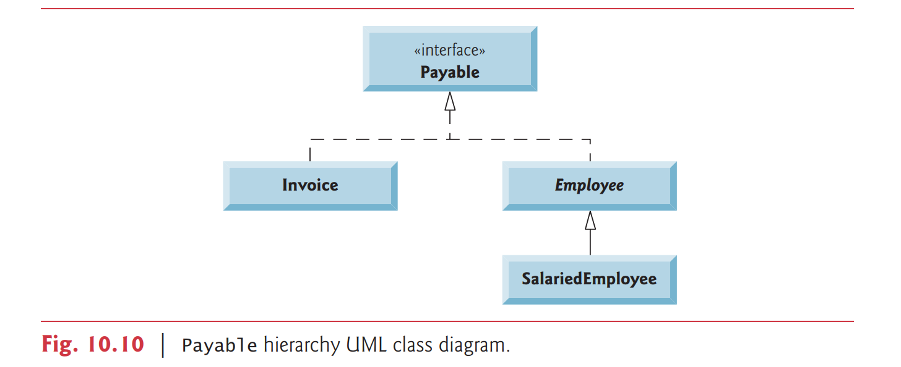
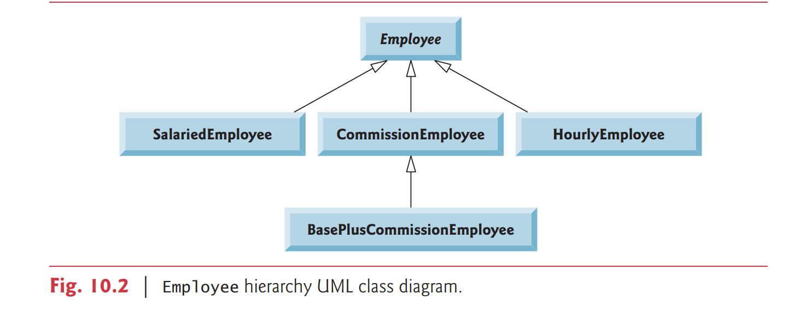

# 10.9 Creating and Using Interfaces
[Note: As written, this section and its code example apply through Java SE 7. Java SE 8’s interface
enhancements are introduced in Section 10.10 and discussed in more detail in Chapter 17.]

Our next example (Figs. 10.11–10.15) reexamines the payroll system of Section 10.5.


Suppose that the company involved wishes to perform several accounting operations in a
single accounts payable application — in addition to calculating the earnings that must be
paid to each employee, the company must also calculate the payment due on each of several invoices (i.e., bills for goods purchased). 

- 在 accounting 方面

Though applied to unrelated things (i.e., employees and invoices), both operations have to do with obtaining some kind of payment amount. 

- 都跟 payment 有關

For an employee, the payment refers to the employee’s earnings. 

- 對於員工來說, payment 可以指的是 earnings

For an invoice, the payment refers to the total cost of the goods listed on the invoice. 

- 對於帳單來說, payment 可以指的是花在商品上的成本

Can we calculate such different things as the payments due for employees and invoices in a single application polymorphically? 


Does Java offer a capability requiring that unrelated classes implement a
set of common methods (e.g., a method that calculates a payment amount)? Java interfaces
offer exactly this capability.

### Standardizing Interactions
Interfaces define and standardize the ways in which things such as people and systems can
interact with one another. 

- Interfaces 可以幫助標準化事情

For example, the controls on a radio serve as an interface between
radio users and a radio’s internal components. 


The controls allow users to perform only a
limited set of operations (e.g., change the station, adjust the volume, choose between AM
and FM), and different radios may implement the controls in different ways (e.g., using
push buttons, dials, voice commands). 


The interface specifies what operations a radio must
permit users to perform but does not specify how the operations are performed.

- interface 可以指定某一個東西要有甚麼功能, 但是並沒有告訴我們要怎麼做

### Software Objects Communicate Via Interfaces
Software objects also communicate via interfaces. 

A Java interface describes a set of methods that can be called on an object to tell it, for example, to perform some task or return some piece of information.

- 在 java 裡面, 可以用 object 呼叫 interface 去執行某些程式或者 return 某些東西


The next example introduces an interface named `Payable` to describe the functionality of any object that must be “capable of being paid” and thus must offer a method to determine the proper payment amount due. 

- Payable 的功能就是一定要有付錢這個選項

An interface declaration
begins with the keyword `interface` and contains **only** constants and abstract methods.

- declaration: 使用 interface keyword
- 只能有 constants 或者是 abstract method


Unlike classes, all interface members must be `public`, and interfaces may not specify any implementation details, such as concrete method declarations and instance variables. 

- interface 一定要是 public

All methods declared in an interface are **implicitly public abstract** methods, and all fields
are **implicitly public, static and final**.

- method 在 interface 裡面就是 public abstract
- state 在 interface 裡面就是 public static final

#### Good Programming Practice 10.1
According to the Java Language Specification, it’s proper style to declare an interface’s
abstract methods without keywords `public` and `abstract`, because they’re redundant
in interface-method declarations. 

Similarly, an interface’s constants should be declared
without keywords public, static and final, because they, too, are redundant.

### Using an Interface
To use an interface, a concrete class must specify that it implements the interface and must
declare each method in the interface with the signature specified in the interface declaration. 

- 使用方法 :
- 要 implements interface
- class 裡面一定要包含 interface 的 method

To specify that a class implements an interface, add the `implements` keyword and the name of the interface to the end of your class declaration’s first line. 


A class that does not
implement all the methods of the interface is an abstract class and must be declared
abstract. 

- 如果一個 class 裡面沒有實作 interface 的 method 就會是 abstract class, 而且一定要被宣告成 abstract class


Implementing an interface is like signing a contract with the compiler that states,
“I will declare all the methods specified by the interface or I will declare my class abstract.”

### Common Programming Error 10.6
Failing to implement any method of an interface in a concrete class that implements the interface results in a compilation error indicating that the class must be declared abstract.


Relating Disparate Types


An interface is often used when disparate classes — i.e., classes that are not related by a class
hierarchy — need to share common methods and constants. 

- interface 並不是依照各個 class 的階層所定義的, 而是看共同有功能

This allows objects of unrelated classes to be processed polymorphically — objects of classes that implement the same interface can respond to the same method calls. 

- 這樣可以讓不相關 classes 的 object 有相同的功能

You can create an interface that describes the desired functionality, then implement this interface in any classes that require that functionality.

- 可以 create 一個 interface 有你想要的 functionality, 然後用在 any class 上

For example, in the accounts payable application developed in this section, we
implement interface Payable in any class that must be able to calculate a payment amount
(e.g., Employee, Invoice).


### Interfaces vs. Abstract Classes
An interface is often used in place of an `abstract` class when there’s no default implementation to
inherit — that is, no fields and no default method implementations. 

- interface = 沒有 state 和 method 的 abstract class

Like `public` `abstract` classes, interfaces are typically public types. 

Like a public class, a public interface must be declared in a file with the same name as the interface and the .java filename extension.


### Software Engineering Observation 10.7
Many developers feel that interfaces are an even more important modeling technology than
classes, especially with the new interface enhancements in Java SE 8 (see Section 10.10).


### Tagging Interfaces
We’ll see in Chapter 15, Files, Streams and Object Serialization, the notion of tagging interfaces (also called marker interfaces)—empty interfaces that have no methods or constant
values. 


They’re used to add is-a relationships to classes. 

- 沒有 state 和 behavior 的 interface 可以加上繼承關係給 classes

For example, in Chapter 15 we’ll
discuss a mechanism called object serialization, which can convert objects to byte representations and can convert those byte representations back to objects. 


To enable this mechanism to work with your objects, you simply have to mark them as Serializable by adding **implements** Serializable to the end of your class declaration’s first line. 


Then, all the objects of your class have the *is-a* relationship with Serializable.

### 10.9.1 Developing a Payable Hierarchy
To build an application that can determine payments for employees and invoices alike, we
first create interface `Payable`, which contains method `getPaymentAmount` that returns a
`double` amount that must be paid for an object of any class that implements the interface.

- Payable 有 getPaymentAmount 可以 return double 

Method `getPaymentAmount` is a general-purpose version of method `earnings` of the
`Employee` hierarchy — method `earnings` calculates a payment amount specifically for an
`Employee`, while `getPaymentAmount` can be applied to a broad range of possibly unrelated
objects. 

- getPaymentAmount 只是一個 general idea
  - earnings 才是真正計算 Employee 的 earning


After declaring interface `Payable`, we introduce class `Invoice`, which implements interface `Payable`. 

- Invoice 有 implements interface, Payable

We then modify class `Employee` such that it also implements interface `Payable`. 

- Employee class 也有 implements interface, Payable

Finally, we update `Employee` subclass `SalariedEmployee` to “fit” into the `Payable` hierarchy by renaming `SalariedEmployee` method `earnings` as `getPaymentAmount`.

- 把 Employee 的 subclass 的 method earnings 名字改成 general 的 getPaymentAmount 


### Good Programming Practice 10.2
When declaring a method in an interface, choose a method name that describes the method’s purpose in a general manner, because the method may be implemented by many unrelated classes.

- 在宣告 interface 時, 最好可以把 method 的名字變得愈 general 愈好, 因為不知道有哪一個 classes 要 implemented


Classes `Invoice` and `Employee` both represent things for which the company must be
able to calculate a payment amount. 

- Invoice 和 Employee 都要計算各自的 payment amount

Both classes implement the `Payable` interface, so a program can invoke method `getPaymentAmount` on `Invoice` objects and `Employee` objects alike. 

- `Invoice` 和 `Employee` 都 implement `Payable` 這一個 interface, 所以 Invoice 和 Employee 都
可以用 `getPaymentAmount`


As we’ll soon see, this enables the polymorphic processing of Invoices and Employees
required for the company’s accounts payable application.

- 這樣就有多型的出現


The UML class diagram in Fig. 10.10 shows the interface and class hierarchy used in
our accounts payable application. 



The hierarchy begins with interface `Payable`. 

- 一開始可以看到 `Payable` 這一個 interface

The UML distinguishes an interface from other classes by placing the word “interface” in guillemets (« and ») above the interface name. 

- interface 在 uml 會用 `<<interface>>`

The UML expresses the relationship between a class
and an interface through a relationship known as **realization**. 

- realization 表示 class 跟 interface 之間的關係

A class is said to realize, or implement, the methods of an interface. 

- 如果 class 要 implement interface

A class diagram models a realization as a dashed
arrow with a hollow arrowhead pointing from the implementing class to the interface. 

- 可以看到有虛線指向 interface

The diagram in Fig. 10.10 indicates that classes Invoice and Employee each realize interface `Payable`. 


As in the class diagram of Fig. 10.2, class `Employee` appears in italics, indicating that it’s an abstract class. 

- 可以在這裡看到 Employee 使用的是斜體字, 表示是 abstract class



Concrete class `SalariedEmployee` extends `Employee`, inheriting its
superclass’s realization relationship with interface `Payable`.

- `SalariedEmployee` 繼承 `Employee` , 所以也會有 `Payable` 的 realization relationship


## 10.9.2 Interface Payable
The declaration of interface `Payable` begins in Fig. 10.11 at line 4. 

```java
// Fig. 10.11: Payable.java
// Payable interface declaration.
public interface Payable {
    double getPaymentAmount(); // calculate payment; no implementation
}
```

Interface `Payable` contains `public` `abstract` method `getPaymentAmount`.

- 裡面的 method 是 `public` `abstract` method

Interface methods are always `public`
and `abstract`, so they do not need to be declared as such. 

- 因為 interface methods 一定都是 `public` `abstract`, 所以不用再另外定義

Interface `Payable` has only one
method, but interfaces can have any number of methods. 

- 這個例子的 interface 只有一個 method, 但是一個 interface 可以有很多 methods

In addition, method `getPaymentAmount` has no parameters, but interface methods can have parameters. 

- 此外, interface 也可以有 parameters, 只不過這一個例子沒有

Interfaces may also contain `final` `static` constants.

- interfaces 可以有 `final` `static` 的常數


## 10.9.3 Class Invoice
We now create class `Invoice` (Fig. 10.12) to represent a simple invoice that contains billing information for only one kind of part. 


The class declares `private` instance variables
`partNumber`, `partDescription`, `quantity` and `pricePerItem` (in lines 6–9) that indicate
the part number, a description of the part, the quantity of the part ordered and the price
per item. 

```java
private final String partNumber;
private final String partDescription;
private int quantity;
private double pricePerItem;
```

Class `Invoice` also contains a constructor (lines 12–26), get and set methods
(lines 29–69) that manipulate the class’s instance variables and a `toString` method (lines
72–78) that returns a String representation of an `Invoice` object. 

```java
// constructor
public Invoice(String partNumber, String partDescription, int quantity, double pricePerItem){
if (quantity < 0) // validate quantity
    throw new IllegalArgumentException("Quantity must be >= 0");
if (pricePerItem < 0.0) // validate pricePerItem
    throw new IllegalArgumentException("Price per item must be >= 0");
this.quantity = quantity;
this.partNumber = partNumber;
this.partDescription = partDescription;
this.pricePerItem = pricePerItem;
} // end constructor
```


Methods `setQuantity`
(lines 41–47) and `setPricePerItem` (lines 56–63) ensure that quantity and pricePerItem obtain only nonnegative values.

```java
// set quantity
public void setQuantity(int quantity)
{
if (quantity < 0) // validate quantity
    throw new IllegalArgumentException("Quantity must be >= 0");
this.quantity = quantity;
}
```

```java
// set price per item
public void setPricePerItem(double pricePerItem) {
if (pricePerItem &lt; 0.0) // validate pricePerItem
    throw new IllegalArgumentException("Price per item must be >= 0");
this.pricePerItem = pricePerItem;
}
```

```java
// Fig. 10.12: Invoice.java
// Invoice class that implements Payable.
public class Invoice implements Payable {
    private final String partNumber;
    private final String partDescription;
    private int quantity;
    private double pricePerItem;
    // constructor
    public Invoice(String partNumber, String partDescription, int quantity, double pricePerItem){
    if (quantity &lt; 0) // validate quantity
        throw new IllegalArgumentException("Quantity must be >= 0");
    if (pricePerItem &lt; 0.0) // validate pricePerItem
        throw new IllegalArgumentException("Price per item must be >= 0");
    this.quantity = quantity;
    this.partNumber = partNumber;
    this.partDescription = partDescription;
    this.pricePerItem = pricePerItem;
    } // end constructor
    // get part number
    public String getPartNumber()
    {
        return partNumber; // should validate
    }
    // get description
    public String getPartDescription()
    {
        return partDescription;
    }
    // set quantity
    public void setQuantity(int quantity)
    {
    if (quantity < 0) // validate quantity
        throw new IllegalArgumentException("Quantity must be >= 0");
    this.quantity = quantity;
    }
    // get quantity
    public int getQuantity()
    {
        return quantity;
    }
    // set price per item
    public void setPricePerItem(double pricePerItem)
    {
        if (pricePerItem &lt; 0.0) // validate pricePerItem
            throw new IllegalArgumentException("Price per item must be >= 0");
        this.pricePerItem = pricePerItem;
    }
    // get price per item
    public double getPricePerItem()
    {
        return pricePerItem;
    }
    // return String representation of Invoice object
    @Override
    public String toString()
    {
        return String.format("%s: %n%s: %s (%s) %n%s: %d %n%s: $%,.2f",
        "invoice", "part number", getPartNumber(), getPartDescription(),
        "quantity", getQuantity(), "price per item", getPricePerItem());
    }
    // method required to carry out contract with interface Payable
    @Override
    public double getPaymentAmount()
    {
        return getQuantity() * getPricePerItem(); // calculate total cost
    }
}
```

### A Class Can Extend Only One Other Class But Can Implement Many Interfaces
Line 4 indicates that class `Invoice` implements interface `Payable`. 


Like all classes, class `Invoice` also implicitly extends `Object`. 


Java does not allow subclasses to inherit from more than one superclass, but it allows a class to inherit from one superclass and implement as many interfaces as it needs. 

- Java 不允許多重繼承, 但是可以 implement 很多 interfaces

To implement more than one interface, use a comma-separated list of interface names after keyword implements in the class declaration, as in:

```
public class ClassName extends SuperclassName implements FirstInterface,
SecondInterface, …
```

Class `Invoice` implements the one `abstract` method in interface `Payable` — method
`getPaymentAmount` is declared in lines 81–85.

```java
    // method required to carry out contract with interface Payable
    @Override
    public double getPaymentAmount()
    {
        return getQuantity() * getPricePerItem(); // calculate total cost
    }
```

The method calculates the total payment required to pay the invoice. 

The method multiplies the values of quantity and `pricePerItem` (obtained through the appropriate get methods) and returns the result. 

This method satisfies the implementation requirement for this method in interface `Payable` — we’ve fulfilled the *interface contract* with the compiler.


## 10.9.4 Modifying Class Employee to Implement Interface Payable


We now modify class `Employee` such that it implements interface `Payable`. 

Figure 10.13 contains the modified class, which is identical to that of Fig. 10.4 with two exceptions.


First, line 4 of Fig. 10.13 indicates that class `Employee` now implements interface `Payable`.

```java
public abstract class Employee implements Payable
```

For this example, we renamed method earnings to` getPaymentAmount` throughout the
Employee hierarchy. 


As with method earnings in the version of class Employee in Fig. 10.4, however, it does not make sense to implement method `getPaymentAmount` in
class `Employee` because we cannot calculate the earnings payment owed to a general Employee—we must first know the specific type of Employee. 

- 因為 abstract 代表 general, 所以在知道哪一種 Employee 之前, 沒辦法寫出 getPaymentAmount 真正的 amount

In Fig. 10.4, we declared method earnings as `abstract` for this reason, so class `Employee` had to be declared abstract.


This forced each `Employee` concrete subclass to override `earnings` with an implementation.

- 這樣可以迫使 Employee 真正的 subclass 去 override earnings 這一個 method

```java
public abstract class Employee implements Payable
{
    private final String firstName;
    private final String lastName;
    private final String socialSecurityNumber;
    // constructor
    public Employee(String firstName, String lastName,
    String socialSecurityNumber)
    {
        this.firstName = firstName;
        this.lastName = lastName;
        this.socialSecurityNumber = socialSecurityNumber;
    }
    // return first name
    public String getFirstName()
    {
        return firstName;
    }
    // return last name
    public String getLastName()
    {
        return lastName;
    }
    // return social security number
    public String getSocialSecurityNumber()
    {
        return socialSecurityNumber;
    }
    // return String representation of Employee object
    @Override
    public String toString()
    {
        return String.format("%s %s%nsocial security number: %s",
    getFirstName(), getLastName(), getSocialSecurityNumber());
    }
} // end abstract class Employee
// Note: We do not implement Payable method getPaymentAmount here so
// this class must be declared abstract to avoid a compilation error.
```


In Fig. 10.13, we handle this situation differently. 


Recall that when a class implements
an interface, it makes a contract with the compiler stating either that the class will implement each method in the interface or the class will be declared abstract. 

- 當 class 有 implements an interface, 就好像是跟 compiler 說 class 不是 abstract class 要不然就是 concrete class


Because class `Employee`
does not provide a `getPaymentAmount` method, the class must be declared `abstract`. 

- 因為 class `Employee` 並沒有 `getPaymentAmount`, 所以 class 一定要是 `abstract`

Any concrete subclass of the abstract class must implement the interface methods to fulfill the superclass’s contract with the compiler. 

- 任何 subclass implements abstract class 都要去自己實作 superclass's 的 method

If the subclass does not do so, it too must be declared abstract. 

- 子類別一定要實作 abstract method, 要不然會一直抽象下去

As indicated by the comments in lines 45–46, class `Employee` of Fig. 10.13 does
not implement method `getPaymentAmount`, so the class is declared `abstract`. 


Each direct `Employee` subclass inherits the superclass’s contract to implement method `getPaymentAmount` and thus must implement this method to become a concrete class for which objects can be instantiated.

- 每一個 Employee 的 subclass 繼承 superclass Employee, 都要 implement abstract method (`getPaymentAmount`)

A class that extends one of Employee’s concrete subclasses will inherit an implementation of `getPaymentAmount` and thus will also be a concrete class.


## 10.9.5 Modifying Class SalariedEmployee for Use in the Payable

Hierarchy Figure 10.14 contains a modified `SalariedEmployee` class that extends `Employee` and fulfills superclass Employee’s contract to implement `Payable` method `getPaymentAmount`.

- extends Employee class
- implements Payable interface

This version of `SalariedEmployee` is identical to that of Fig. 10.5, but it replaces method `earnings` with method `getPaymentAmount` (lines 39–43). 

```java
// Fig. 10.14: SalariedEmployee.java
// SalariedEmployee class that implements interface Payable.
// method getPaymentAmount.
public class SalariedEmployee extends Employee
{
    private double weeklySalary;
    // constructor
    public SalariedEmployee(String firstName, String lastName,
    String socialSecurityNumber, double weeklySalary)
    {
        super(firstName, lastName, socialSecurityNumber);
        if (weeklySalary < 0.0)
        throw new IllegalArgumentException(
        "Weekly salary must be >= 0.0");
        this.weeklySalary = weeklySalary;
    }
    // set salary
    public void setWeeklySalary(double weeklySalary)
    {
        if (weeklySalary < 0.0)
        throw new IllegalArgumentException(
        "Weekly salary must be >= 0.0");
        this.weeklySalary = weeklySalary;
    }
    // return salary
    public double getWeeklySalary()
    {
        return weeklySalary;
    }
    // calculate earnings; implement interface Payable method that was
    // abstract in superclass Employee
    @Override
    public double getPaymentAmount()
    {
        return getWeeklySalary();
    }
    // return String representation of SalariedEmployee object
    @Override
    public String toString()
    {
        return String.format("salaried employee: %s%n%s: $%,.2f",
        super.toString(), "weekly salary", getWeeklySalary());
    }
} // end class SalariedEmployee

```


Recall that the `Payable` version
of the method has a more general name to be applicable to possibly disparate classes. 


(If we included the remaining `Employee` subclasses from Section 10.5 — `HourlyEmployee`, `CommissionEmployee` and `BasePlusCommissionEmployee` — in this example, their earnings methods should also be renamed `getPaymentAmount`. 

- 如果我們要有 Employee 的 subclass, 那麼就要把 `earnings` method 改名成 `getPaymentAmount`

We leave these modifications to Exercise 10.15 and use only `SalariedEmployee` in our test program here.


Exercise 10.16 asks you to implement interface `Payable` in the entire `Employee` class hierarchy of Figs. 10.4–10.9 without modifying the `Employee` subclasses.)


When a class implements an interface, the same `is-a` relationship provided by inheritance applies. 

- 當 implement interfaces 也會有繼承的關係

Class `Employee` implements `Payable`, so we can say that an Employee is a
`Payable`. 

- 我們可以說 Employee is a Payable

In fact, objects of any classes that extend `Employee` are also `Payable` objects. 

- 事實上任何繼承 `Employee` 的 subclass 都有 `Payable` objects

`SalariedEmployee` objects, for instance, are `Payable` objects. 


Objects of any subclasses of the class that implements the interface can also be thought of as objects of the interface type.

- objects 有 interfaces 的可以被看成 interface type 的 object


Thus, just as we can assign the reference of a `SalariedEmployee` object to a superclass `Employee` variable, we can assign the reference of a `SalariedEmployee` object to an interface `Payable` variable. 

- 我們可以 assign child class 的 reference 到 superclass variable 和 interface 的 variable

`Invoice` implements `Payable`, so an `Invoice` object also is a `Payable` object, and we can assign the reference of an `Invoice` object to a `Payable` variable.


## 10.9.6 Using Interface Payable to Process Invoices and Employees

Polymorphically `PayableInterfaceTest` (Fig. 10.15) illustrates that interface `Payable` can be used to process a set of Invoices and Employees polymorphically in a single application. 


Line 9 declares
`payableObjects` and assigns it an array of four Payable variables. 

```java
Payable[] payableObjects = new Payable[4];
```

Lines 12–13 assign the
references of `Invoice` objects to the first two elements of `payableObjects`.

```java
payableObjects[0] = new Invoice("01234", "seat", 2, 375.00);
payableObjects[1] = new Invoice("56789", "tire", 4, 79.95);
```

Lines 14–17
then assign the references of `SalariedEmployee` objects to the remaining two elements of
`payableObjects`. 

```java
payableObjects[2] = new SalariedEmployee("John", "Smith", "111-11-1111", 800.00);
payableObjects[3] =new SalariedEmployee("Lisa", "Barnes", "888-88-8888", 1200.00);

```


These assignments are allowed because an `Invoice` is a `Payable`, a `SalariedEmployee` is an `Employee` and an `Employee` is a `Payable`. 


可以看到只要有 implement Payable, 就可以把自己的 references 存到 Payable 的 objects 裡面


---


Lines 23–29 use the enhanced for statement to polymorphically process each Payable object in `payableObjects`,
printing the object as a `String`, along with the payment amount due. 

```java
// generically process each element in array payableObjects
for (Payable currentPayable : payableObjects)
{
    // output currentPayable and its appropriate payment amount
    System.out.printf("%n%s %n%s: $%,.2f%n","payment due", currentPayable.toString() // could invoke implicitly
    , currentPayable.getPaymentAmount());
}
```

Line 27 invokes method `toString` via a `Payable` interface reference, even though `toString` is not declared
in interface `Payable` — all references (including those of interface types) refer to objects that extend `Object` and therefore have a `toString` method. 

- 可以看到 interface 也有 `toString` method, 所有的 references 包括 interfaces type 都繼承 Object, 所以有 `toString` method

(Method `toString` also can be invoked implicitly here.) 


Line 28 invokes `Payable` method `getPaymentAmount` to obtain the payment amount for each object in `payableObjects`, regardless of the actual type of the object.


The output reveals that each of the method calls in lines 27–28 invokes the appropriate
class’s implementation of methods `toString` and `getPaymentAmount`. 


For instance, when `currentPayable` refers to an `Invoice` during the first iteration of the for loop, class Invoice’s `toString` and `getPaymentAmount` execute.
