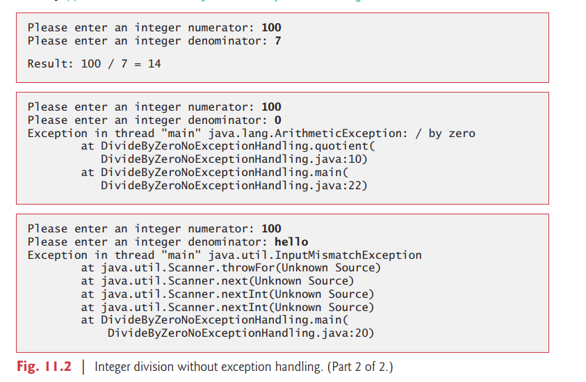

# 11.2 Example: Divide by Zero without Exception Handling

First we demonstrate what happens when errors arise in an application that does not use
exception handling. 


Figure 11.2 prompts the user for two integers and passes them to
method `quotient`, which calculates the integer `quotient` and returns an int result. 


In this example, you’ll see that exceptions are thrown (i.e., the exception occurs) by a method
when it detects a problem and is unable to handle it.

```java
// Fig. 11.2: DivideByZeroNoExceptionHandling.java
// Integer division without exception handling.

import java.util.Scanner;

public class DivideByZeroNoExceptionHandling {
    public static int quotient(int numerator, int denominator) {
        return numerator / denominator; // possible division by zero
    }

    public static void main(String[] args) {
        Scanner scanner = new Scanner(System.in);

        System.out.print("Please enter an integer numerator: ");
        int numerator = scanner.nextInt();
        System.out.print("Please enter an integer denominator: ");
        int denominator = scanner.nextInt();

        int result = quotient(numerator, denominator);
        System.out.printf("%nResult: %d / %d = %d%n", numerator, denominator, result);
    }

} // end class DivideByZeroNoExceptionHandling

```

```
Please enter an integer numerator: 100
Please enter an integer denominator: 0
Exception in thread "main" java.lang.ArithmeticException: / by zero
	at DivideByZeroNoExceptionHandling.quotient(DivideByZeroNoExceptionHandling.java:8)
	at DivideByZeroNoExceptionHandling.main(DivideByZeroNoExceptionHandling.java:19)

```

```
Please enter an integer numerator: 100
Please enter an integer denominator: hi
Exception in thread "main" java.util.InputMismatchException
	at java.base/java.util.Scanner.throwFor(Scanner.java:939)
	at java.base/java.util.Scanner.next(Scanner.java:1594)
	at java.base/java.util.Scanner.nextInt(Scanner.java:2258)
	at java.base/java.util.Scanner.nextInt(Scanner.java:2212)
	at DivideByZeroNoExceptionHandling.main(DivideByZeroNoExceptionHandling.java:17)
```

### Stack Trace
The first sample execution in Fig. 11.2 shows a successful division. 

In the second execution, the user enters the value 0 as the denominator. 


Several lines of information are displayed in response to this invalid input. 

This information is known as a stack trace, which includes the name of the exception (java.lang.ArithmeticException) in a descriptive message that indicates the problem that occurred and the method-call stack (i.e., the call chain) at the time it occurred. 

- stack track 表示 exception 的 message 還有在 method-call stack 剩下的 method call

The stack trace includes the path of execution that led to the exception method by method. 

This helps you debug the program.


### Stack Trace for an ArithmeticException
The first line specifies that an `ArithmeticException` has occurred. 


The text after the name of the exception (“/ by zero”) indicates that this exception occurred as a result of an attempt to divide by zero. 


Java does not allow division by zero in integer arithmetic. 

When this occurs, Java throws an `ArithmeticException`. 


`ArithmeticExceptions` can arise from a number of different problems, so the extra data (“/ by zero”) provides more specific information. 


Java does allow division by zero with floating-point values. 

- Java 允許 devide by floating point 的 0.0

Such a calculation results in the value positive or negative infinity, which is represented in Java as a floatingpoint value (but displays as the string Infinity or -Infinity). 

-  結果會是正無限大或者是負無限大


If 0.0 is divided by 0.0, the result is NaN (not a number), which is also represented in Java as a floating-point value (but displays as NaN). 

- 0.0 / 0.0  ==> NaN

If you need to compare a floating-point value to NaN, use the method
`isNaN` of class `Float` (for float values) or of class `Double` (for double values). 

```
public boolean isNaN()
Returns true if this Float value is a Not-a-Number (NaN), false otherwise.
Returns:
true if the value represented by this object is NaN; false otherwise.
```


Classes `Float` and `Double` are in package java.lang.


Starting from the last line of the stack trace, we see that the exception was detected in
line 22 of method main. 


Each line of the stack trace contains the class name and method
(e.g., DivideByZeroNoExceptionHandling.main) followed by the filename and line
number (e.g., DivideByZeroNoExceptionHandling.java:22). 

- DivideByZeroNoExceptionHandling : class name
- main : method
- DivideByZeroNoExceptionHandling.java : filename 
- 22 : line number


Moving up the stack trace, we see that the exception occurs in line 10, in method quotient. 

- 所以可以看到 exception occurs 在第 10 行 (書本的第 10 行)

The top row of the call chain indicates the throw point — the initial point at which the exception occurred. 

- call chian 的第一個就表示發生 exception 的地方


The throw point of this exception is in line 10 of method quotient.

### Stack Trace for an InputMismatchException

In the third execution, the user enters the string "hello" as the denominator. 

Notice again that a stack trace is displayed. 

This informs us that an `InputMismatchException` has occurred (package java.util). 

Our prior examples that input numeric values assumed that the user would input a proper integer value. 

However, users sometimes make mistakes and input noninteger values. 


An `InputMismatchException` occurs when `Scanner` method `nextInt` receives a string that does not represent a valid integer. 

- `InputMismatchException` 發生的時候是 `Scanner` 的 method `nextInt` 收到 value 的 data type 是 string 而不是 integer


Starting from the end of the stack trace, we see that the exception was detected in line 20 of method main. 

- 可以看到 stack trace 的最後一行, exception 發生在 main method 的第 20 行

Moving up the stack trace, we see that the exception occurred in method `nextInt`. 

- 往上看可以看到 exception 也發生在 method `nextInt`

Notice that in place of the filename and line number, we’re provided with the text Unknown Source. 




- 在課本的例子可以看到括弧裡面是 Unknown Source


This means that the so-called debugging symbols that provide the filename and line number information for that method’s class were not available to the JVM — this is typically the case for the classes of the Java API. 

- 這表示 debugging symbols 提供了在那一個 method's class 的 filename and line number info 是不提供給 JVM 

Many IDEs have access to the Java API source code and will display filenames and line numbers in stack traces.

- 但是很多 IDE 都會有 API docs 所以可以 trace 到來源在哪


### Program Termination

In the sample executions of Fig. 11.2 when exceptions occur and stack traces are displayed,
the program also exits. 


This does not always occur in Java. 


Sometimes a program may continue even though an exception has occurred and a stack trace has been printed. 

- 有時候 a program 會持續進行即便 throw an exception 

In such cases, the application may produce unexpected results. 

- 這樣就會出問題

For example, a graphical user interface (GUI) application will often continue executing. 


In Fig. 11.2 both types of exceptions were detected in method main. 

In the next example, we’ll see how to handle these exceptions so that you can enable the program to run to normal completion.


