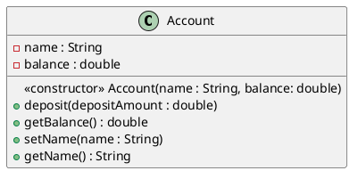

# 3.5 Account Class with a Balance; Floating-Point Numbers

We now declare an Account class that maintains the balance of a bank account in addition to the name. 

Most account balances are not integers. 

可以看到宣告了Account class 裡面有 balance of a bank account 還有name, 大部分的 balance 並不是整數

--

So, class Account represents the account balance as a floating-point number—a number with a decimal point, such as 43.95, 0.0, –129.8873. [In Chapter 8, we’ll begin representing monetary amounts precisely with
class BigDecimal as you should do when writing industrial-strength monetary applications.]

---

Java provides two primitive types for storing floating-point numbers in memory— ```float``` and ```double```. 

Java提供2種primitive type 存浮點數, float跟double

---

Variables of type float represent single-precision floating-point numbers and can hold up to seven significant digits. 

float 為單精位浮點數，最多可以放入小數點後七位

---

Variables of type double represent doubleprecision floating-point numbers. 

double 為雙精位浮點數

---

These require twice as much memory as float variables and can hold up to 15 significant digits—about double the precision of float variables.

表示 double 可以比 float 多2倍的 memory, 可以最多放置小數點後15位

---

Most programmers represent floating-point numbers with type double. 

In fact, Java treats all floating-point numbers you type in a program’s source code (such as 7.33 and 0.0975) as double values by default. 

Such values in the source code are known as ```floating-point literals```. 

See Appendix D, Primitive Types, for the precise ranges of values for floats and doubles.

---

## 3.5.1 Account Class with a balance Instance Variable of Type double

Our next app contains a version of class Account (Fig. 3.8) that maintains as instance variables the name and the balance of a bank account. 

在這一個 example 會有一個 class Account, 裡面有 name 及 balance

---

A typical bank services many accounts, each with its own balance, so line 8 declares an instance variable balance of type double.

但因為 balance 並不是整數，所以把 data type 設 double

---

Every instance (i.e., object) of class Account contains its own copies of both the name and the balance.

---

```java
public class Account(){
    // instance variables
    private String name;
    private double balance;

    // account constructor receives 2 parameters
    public Account(String name, double balance){
        // assign name to instance variable name
        this.name = name;
        // 但是 balance 要大於0 , 整個 balaance 才會有意義, 所以用if balance >= 0.0, 才把值放進來
        if(balance >= 0.0){
            this.balance = balance;
        }
    }

    // method that adds money to the balance(存錢method)
    public void deposit(double depositAmount){
        // 當我存多於 0元，我的 balance 會增加
        if(depositAmount > 0.0) {
            balance += depositAmount;
        }
    }

    // method returns the account balance
    public double getBalance(){
        return balance;
    }

    // method that sets name
    public void setName(String name) {
        this.name = name;
    }

    // method that gets name
    public String getName(){
        return name;
    }
}


```

---

### Account Class Two-Parameter Constructor

The class has a constructor and four methods. 

It’s common for someone opening an account to deposit money immediately, so the constructor (lines 11–19) now receives a second parameter - initialBalance of type double that represents the starting balance. 

這個 class 有一個 constructor 還有 4個 methods, 
開戶馬上存錢是一件非常普遍的事，所以 constructor 收到第二個參數叫做 initialBalance, 這個 data type 是 double, 這個代表 starting balance.

---

Lines 17–18 ensure that initialBalance is greater than 0.0. 

If so, initialBalance’s value is assigned to instance variable balance. 

Otherwise, balance remains at 0.0 — its default initial value.

Line 17,18 是在 constructor 裡面的 if, initialBalnce 的 value 是被 assign 到變數 balance裡面 ，要不然會維持 0.0, 他的 default initial value.

---

### Account Class deposit Method

Method deposit (lines 22–26) does not return any data when it completes its task, so its return type is void. 

在 method deposit 並不會回傳任何 data, 因為存錢之後不會再拿到東西，所以回傳 void

---

The method receives one parameter named ```depositAmount``` — a double value that’s added to the balance only if the parameter value is valid (i.e., greater than
zero). 

這個 medhod deposit 會接受 one parameter named ```depositAmount```, 這是一個 double value, 假如 parameter 是大於 0, 那麼這個的 parameter value 就會生效

---

Line 25 first adds the current balance and depositAmount, forming a temporary sum which is then assigned to balance, replacing its prior value (recall that addition has a
higher precedence than assignment). 

```java
balance = balance + depositAmount; 
```
這一行表示把存進去的錢和已經在裡面的存款相加，會形成一個暫時的 sum, 那這一個 temporary sum 會被賦值給 blaance, 並且取代掉之前的 value

---

It’s important to understand that the calculation on
the right side of the assignment operator in line 25 does not modify the balance — that’s why the assignment is necessary

---

### Account Class getBalance Method

Method getBalance (lines 29–32) allows clients of the class (i.e., other classes whose methods call the methods of this class) to obtain the value of a particular Account object’s balance. 

method getBalance 可以使任何 call這一個 function 的 clients 獲得 balance

---

The method specifies return type double and an empty parameter list.

因為要獲得 balance, 所以不用有參數，而直接回傳 return type

---

### Account’s Methods Can All Use balance

Once again, the statements in lines 18, 25 and 31 use the variable balance even though it was not declared in any of the methods. 

We can use balance in these methods because it’s an instance variable of the class.

---

## 3.5.2 AccountTest Class to Use Class Account

Class AccountTest (Fig. 3.9) creates two Account objects (lines 9–10) and initializes them with a valid balance of 50.00 and an invalid balance of -7.53, respectively—for the purpose of our examples, we assume that balances must be greater than or equal to zero. 


The calls to method ```System.out.printf``` in lines 13–16 output the account names and balances, which are obtained by calling each Account’s getName and getBalance methods.

```java
import java.util.Scanner;
public class AccountTest{
    public static void main(String [] args) {
        Account account1 = new Account();
        Account account2 = new Account();

        System.out.printf("%s balance: $%.2f%n", account1.getName(), account1.getBalance());
        System.out.printf("%s balance: $%.2f%n", account2.getName(), account2.getBalance());

        Scanner input = new Scanner(System.in);
        
        System.out.print("Enter deposit amount for account 1: ");
        // obtain user input
        double depositAmount = input.nextDouble();
        System.out.printf("%nadding %.2f to account1's balance%n%n", depositAmount);
        // add to account1 balance
        account1.deposit(depositAmount);

        System.out.printf("%s balance: $%.2f%n", account1.getName(), account1.getBalance());
        System.out.printf("%s balance: $%.2f%n", account2.getName(), account2.getBalance());

        System.out.print("Enter deposit amount for account 2: ");
        // obtain user input
        depositAmount = input.nextDouble();
        System.out.printf("%nadding %.2f to account2's balance%n%n", depositAmount);
        // add to account2 balance
        account2.deposit(depositAmount);

        System.out.printf("%s balance: $%.2f%n", account1.getName(), account1.getBalance());
        System.out.printf("%s balance: $%.2f%n", account2.getName(), account2.getBalance());
    }
}
```

---

### Displaying the Account Objects’ Initial Balances

When method getBalance is called for account1 from line 14, the value of account1’s balance is returned from line 31 of Fig. 3.8 and displayed by the System.out.printf
statement (Fig. 3.9, lines 13–14). 

```java
 this.balance = balance;
```
```java
System.out.printf("%s balance: $ %n", account1.getName(), account1.getBalance());
```


當 method getBalance 在第14行 is called for account 1,這是之前的Account.java, account1的目前存款會回傳給第 31 行的 code(AccountTest.java), 用來 display value of balance


---

Similarly, when method getBalance is called for
account2 from line 16, the value of the account2’s balance is returned from line 31 of
Fig. 3.8 and displayed by the System.out.printf statement (Fig. 3.9, lines 15–16). 


The balance of account2 is initially 0.00, because the constructor rejected the attempt to start
account2 with a negative balance, so the balance retains its default initial value.

---
### Formatting Floating-Point Numbers for Display

Each of the balances is output by printf with the format specifier %.2f. 

The %f format specifier is used to output values of type float or double. 

The .2 between % and f represents the number of decimal places (2) that should be output to the right of the decimal point in the floating-point number—also known as the number’s precision. 

Any floatingpoint value output with %.2f will be rounded to the hundredths position—for example,
123.457 would be rounded to 123.46 and 27.33379 would be rounded to 27.33

%f: 用來表示float或double, .2表示小數點後2位, 其餘的四捨五入

---

### Reading a Floating-Point Value from the User and Making a Deposit

Line 21 (Fig. 3.9) prompts the user to enter a deposit amount for account1. 

```java
System.out.print("Enter deposit amount for account1: "); 
```
Line 22 declares local variable depositAmount to store each deposit amount entered by the user. 

```java
double depositAmount = input.nextDouble(); 
```

Unlike instance variables (such as name and balance in class Account), local variables (like
depositAmount in main) are not initialized by default, so they normally must be initialized
explicitly.

local variable (depositAmount) 並沒有被初始化，所以要另外處理

---

As you’ll learn momentarily, variable depositAmount’s initial value will be determined by the user’s input.

---

Line 22 obtains the input from the user by calling Scanner object input’s nextDouble
method, which returns a double value entered by the user. 

```java
double depositAmount = input.nextDouble();
```
Lines 23–24 display the depositAmount. 
```java
System.out.printf("%nadding to account1 balance%n%n", depositAmount);
```

Line 25 calls object account1’s deposit method with the depositAmount as the method’s argument. 

```java
account1.deposit(depositAmount); 
```

When the method is called, the argument’s value is assigned to the parameter depositAmount of method deposit (line 22 of Fig. 3.8); 

```java
public void deposit(double depositAmount) {
    if (depositAmount > 0.0) // if the depositAmount is valid
        balance = balance + depositAmount; // add it to the balance
}
```
當method deposit 被 called, 程式會跑到 (Account.java))的第22行，並且把 argument's 的 value assigned 到 parameter(depositAmount)

---

then method deposit adds that value to the balance. 

然後 method deposit adds the value to the balance

---

Lines 28–31 (Fig. 3.9) output the names and balances of both Accounts again to show that only account1’s balance has changed.

```java
System.out.printf("%s balance: $ %n",
 account1.getName(), );
 System.out.printf("%s balance: $ %n%n",
 account2.getName(), );
```

輸出可以看見只有 account1有發生變化

---

Line 33 prompts the user to enter a deposit amount for account2. 

Line 34 obtains the input from the user by calling Scanner object input’s nextDouble method. 

Lines 35–36 display the depositAmount. 

Line 37 calls object account2’s deposit method with
depositAmount as the method’s argument; then method deposit adds that value to the balance. 

Finally, lines 40–43 output the names and balances of both Accounts again to show that only account2’s balance has changed.

---
### Duplicated Code in Method main
The six statements at lines 13–14, 15–16, 28–29, 30–31, 40–41 and 42–43 are almost
identical — they each output an Account’s name and balance. 

They differ only in the name of the Account object—account1 or account2. 

Duplicate code like this can create code
maintenance problems when that code needs to be updated — if six copies of the same code
all have the same error or update to be made, you must make that change six times, without
making errors. 

Exercise 3.15 asks you to modify Fig. 3.9 to include a ```displayAccount``` method that takes as a parameter an Account object and outputs the object’s name and balance. 

You’ll then replace main’s duplicated statements with six calls to displayAccount, thus reducing the size of your program and improving its maintainability by having one copy of the code that displays an Account’s name and balance.


---

### UML Class Diagram for Class Account

The UML class diagram in Fig. 3.10 concisely models class Account of Fig. 3.8. 

The diagram models in its second compartment the private attributes name of type String and balance of type double.



Class Account’s constructor is modeled in the third compartment with parameters name of type String and initialBalance of type double. 

The class’s four public methods also are modeled in the third compartment—operation deposit with a depositAmount parameter of type double, operation getBalance with a return type of double, operation setName with a name parameter of type String and operation getName with a return type of String.

---