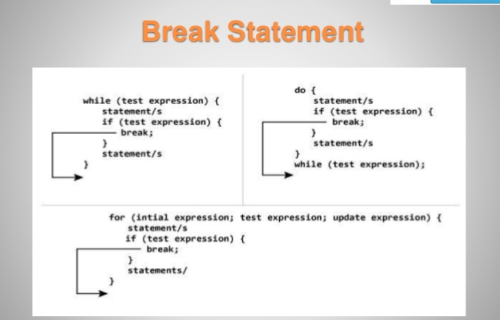
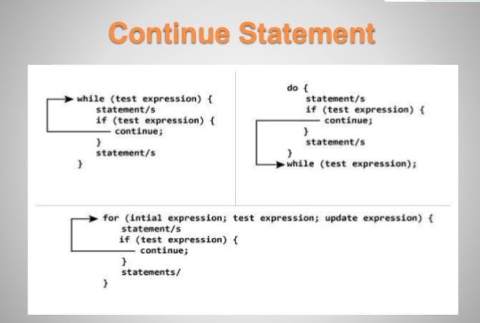

# break and continue Statements
In addition to selection and repetition statements, Java provides statements break (which we discussed in the context of the switch statement) and continue (presented in this section and online Appendix L) to alter the flow of control. 

The preceding section showed how break can be used to terminate a switch statement’s execution. 

This section discusses how to use break in repetition statements.

### break Statement
The break statement, when executed in a while, for, do…while or switch, causes immediate exit from that statement. 

break 會導致 loop terminate

---

Execution continues with the first statement after the control statement. 

continue 會回到第一個 statement 執行

---

Common uses of the break statement are to escape early from a loop or to
skip the remainder of a switch (as in Fig. 5.9). Figure 5.13 demonstrates a break statement exiting a for.

---


```java
public class BreakTest {
    public static void main(String [] args) {
        int count;
        for(int count = 1; count <=10; count++) {
            if(count == 5) break;
            System.out.printf("%d ", count);
        }
        System.out.printf("%nBroke out of loop at count = %d%n", count);
    } 
}
```

When the if statement nested at lines 11–12 in the for statement (lines 9–15) detects
that count is 5, the break statement at line 12 executes. 

當 if nested 在for loop 裡面，且detect 到 count 等於5時，break 就會執行


---

This terminates the for statement,
and the program proceeds to line 17 (immediately after the for statement), which displays
a message indicating the value of the control variable when the loop terminated. 

The loop fully executes its body only four times instead of 10.

完整的執行應該只有 4 次




----

### continue Statement

The continue statement, when executed in a while, for or do…while, skips the remaining statements in the loop body and proceeds with the next iteration of the loop.

遇到 continue, 會跳過剩下的 statement, 直接回到下一個 step, (可能是++)

----

In while and do…while statements, the program evaluates the loop-continuation test immediately
after the continue statement executes. 

在 while 跟 do...while 中， program 一碰到continue會重新loop 

---

In a for statement, the increment expression executes,then the program evaluates the loop-continuation test.

在 for 中，++或--會先執行，再去第一個 statement 執行

---


---

Figure 5.14 uses continue (line 10) to skip the statement at line 12 when the nested
if determines that count’s value is 5. 

When the continue statement executes, program
control continues with the increment of the control variable in the for statement (line 7).

In Section 5.3, we stated that while could be used in most cases in place of for. 

This is not true when the increment expression in the while follows a continue statement. 

In this case, the increment does **not** execute before the program evaluates the repetition-continuation condition, so the while does not execute in the same manner as the for.

在 continue 時，for 跟 while 會不太相同，while 不會做 increment, 但是 for 會做 increment 再去做第一個 statement

---
