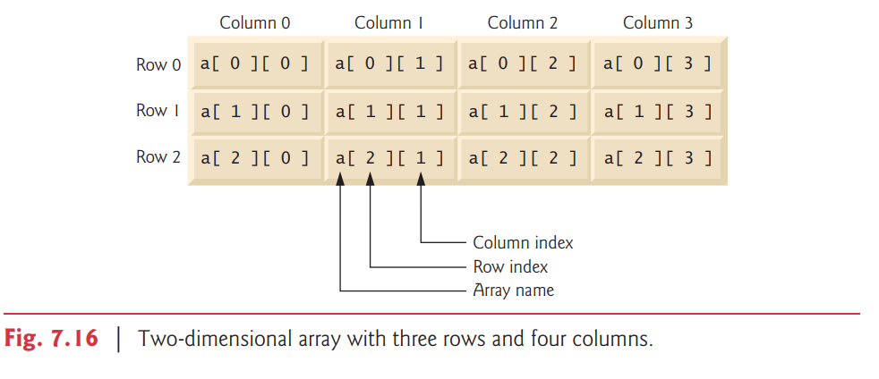

# 7.11 Multidimensional Arrays

Multidimensional arrays with two dimensions are often used to represent tables of values
with data arranged in rows and columns. 

二維矩陣常被用來代表表格 (excel)


To identify a particular table element, you specify two indices. 

要獲取 table element, 必須要有 2 個 indices

By convention, the first identifies the element’s row and the second its column.

第一個通常是 row(-)
第二個通常是 column(|)

Arrays that require two indices to identify each element are called two-dimensional arrays.

有 2 個 indices 代表是二維矩陣


(Multidimensional arrays can have more than two dimensions.) 

多維矩陣所代表的 indicies 更多

Java does not support multidimensional arrays directly, but it allows you to specify one-dimensional arrays whose elements are also one-dimensional arrays, thus achieving the same effect. 

java 不 support 多維矩陣, 但是可以接受一維矩陣裡面再包含另外一個一維的矩陣

Figure 7.16 illustrates a two-dimensional array named a with three rows and four columns (i.e., a three-by-four array). In general, an array with m rows and n columns is called an ```m-by-n``` array.

3 列 4 行的表格




Every element in array a is identified in Fig. 7.16 by an array-access expression of the form
```a[row][column]```; a is the name of the array, and row and column are the indices that uniquely
identify each element by row and column index. 


The names of the elements in row 0 all have a first index of 0, and the names of the elements in column 3 all have a second index of 3.


### Arrays of One-Dimensional Arrays

Like one-dimensional arrays, multidimensional arrays can be initialized with array initializers in declarations. 

也可以用 2 個一維矩陣


A two-dimensional array b with two rows and two columns could be declared and initialized with nested array initializers as follows:

```java
int[][] b = {{1, 2}, {3, 4}};
```
The initial values are grouped by row in braces. 

So 1 and 2 initialize ```b[0][0]``` and ```b[0][1]```,
respectively, and 3 and 4 initialize ```b[1][0]``` and ```b[1][1]```, respectively. 

順序是由左到右,由上到下


The compiler counts the number of nested array initializers (represented by sets of braces within the outer braces) to determine the number of rows in array b. 

the compiler 會計算裡面的 ```{}``` 總共會有多少個, 去決定有多少 row 在 array b 裡面


The compiler counts the initializer values in the nested array initializer for a row to determine the number of columns in that row.

然後在 row 裡面去算有幾個元素來決定 column 有幾個

As we’ll see momentarily, this means that rows can have different lengths.

rows 可以有不同的長度

Multidimensional arrays are maintained as arrays of one-dimensional arrays. 

多維矩陣會被視為一維的矩陣

Therefore array b in the preceding declaration is actually composed of two separate one-dimensional
arrays—one containing the values in the first nested initializer list {1, 2} and one containing the values in the second nested initializer list {3, 4}. 

所以上面的 code 會被解釋成有一個 list ```{1,2}``` 跟另外一個 list ```{3,4}```

Thus, array b itself is an array of two elements, each a one-dimensional array of int values.

所以 array b 有 2 個 elements, 他們分別都是一維矩陣

### Two-Dimensional Arrays with Rows of Different Lengths

The manner in which multidimensional arrays are represented makes them quite flexible.

In fact, the lengths of the rows in array b are not required to be the same. 

rows(-) 的個數不一定要一樣

For example,

```java
int[][] b = {{1, 2}, {3, 4, 5}};
```

```
1   2
3   4   5
```

creates integer array b with two elements (determined by the number of nested array initializers) that represent the rows of the two-dimensional array. 


Each element of b is a reference to a one-dimensional array of int variables. 

在 arrayb 有 2 個 elements, ```{1,2}``` 跟 ```{3,4,5}```, 這 2 個 element 都是 reference


The int array for row 0 is a onedimensional array with two elements (1 and 2), and the int array for row 1 is a one-dimensional array with three elements (3, 4 and 5).


### Creating Two-Dimensional Arrays with Array-Creation Expressions


A multidimensional array with the same number of columns in every row can be created with an array-creation expression. 


For example, the following line declares array b and assign it a reference to a three-by-four array:

```java
int[][] b = new int[3][4];
```

In this case, we use the literal values 3 and 4 to specify the number of rows and number of
columns, respectively, but this is not required. 


Programs can also use variables to specify array dimensions, because new creates arrays at execution time—not at compile time. 

使用 keyword new 一個 array, 會create 一個 array 在 execution time, 並不是在 compile time


The elements of a multidimensional array are initialized when the array object is created.

當被 created, elements 就會被初始化

A multidimensional array in which each row has a different number of columns can be created as follows:

```java
int[][] b = new int[2][]; // create 2 rows
b[0] = new int[5]; // create 5 columns for row 0
b[1] = new int[3]; // create 3 columns for row 1
```

```
1 1
2 2
3
4
5
```

The preceding statements create a two-dimensional array with two rows. 

Row 0 has five columns, and row 1 has three columns.

### Two-Dimensional Array Example: Displaying Element Values

Figure 7.17 demonstrates initializing two-dimensional arrays with array initializers, and
using nested for loops to traverse the arrays (i.e., manipulate every element of each array).

Class ```InitArray’s``` main declares two arrays. 

The declaration of array1 (line 9) uses nested array initializers of the same length to initialize the first row to the values 1, 2 and 3, and the second row to the values 4, 5 and 6. 

```java
int[][] array1 = {{1, 2, 3}, {4, 5, 6}};
int[][] array2 = {{1, 2}, {3}, {4, 5, 6}};
```

The declaration of array2 (line 10) uses nested initializers of different lengths. 

In this case, the first row is initialized to two elements with the values 1 and 2, respectively. 

The second row is initialized to one element with the value 3. 

The third row is initialized to three elements with the values 4, 5 and 6, respectively.

```
array1
1  2  3
4  5  6
```

```
array2
1  2
3
4  5  6
```


```java
// Fig. 7.17: InitArray.java
// Initializing two-dimensional arrays.
public class InitArray
{
    // create and output two-dimensional arrays
    public static void main(String[] args)
    {
        int[][] array1 = {{1, 2, 3}, {4, 5, 6}};
        int[][] array2 = {{1, 2}, {3}, {4, 5, 6}};

        System.out.println("Values in array1 by row are"); 
        outputArray(array1); // displays array1 by row
        System.out.printf("%nValues in array2 by row are%n");
        outputArray(array2); // displays array2 by row
    }
    
    // output rows and columns of a two-dimensional array
    public static void outputArray(int[][] array)
    {
    // loop through array's rows
        for (int row = 0; row < array.length; row++) {
        // loop through columns of current row
            for (int column = 0; column < array[row].length; column++)
                System.out.printf("%d ", array[row][column]);
            System.out.println();
        }
    }
}
```
印的順序是由左到右, 再由上到下

Lines 13 and 16 call method ```outputArray``` (lines 20–31) to output the elements of array1 and array2, respectively. 

Method ```outputArray’s``` parameter—int[][] array— indicates that the method receives a two-dimensional array. 


The nested for statement (lines 23–30) outputs the rows of a two-dimensional array. 

In the loop-continuation condition of the outer for statement, the expression ```array.length``` determines the number of rows in the array. 

先決定 rows 有幾列

In the inner for statement, the expression ```array[row].length``` determines the number of columns in the current row of the array. 

再決定column 有幾行

The inner for statement’s condition enables the loop to determine the exact number of columns in each row.

We demonstrate nested enhanced for statements in Fig. 7.18.


### Common Multidimensional-Array Manipulations Performed with for Statements
Many common array manipulations use for statements. 

As an example, the following for statement sets all the elements in row 2 of array a in Fig. 7.16 to zero:

```java
for (int column = 0; column < a[2].length; column++)
a[2][column] = 0;
```
We specified row 2; therefore, we know that the first index is always 2 (0 is the first row,
and 1 is the second row). 

This for loop varies only the second index (i.e., the column index). If row 2 of array a contains four elements, then the preceding for statement is equivalent to the assignment statements

```
a[2][0] = 0;
a[2][1] = 0;
a[2][2] = 0;
a[2][3] = 0;
```

```java
int total = 0;
for (int row = 0; row < a.length; row++) {
    for (int column = 0; column < a[row].length; column++)
        total += a[row][column];
}
```


These nested for statements total the array elements one row at a time. 

The outer for statement begins by setting the row index to 0 so that the first row’s elements can be totaled by the inner for statement. 

先固定橫的

The outer for then increments row to 1 so that the second row can be totaled. 

Then, the outer for increments row to 2 so that the third row can be totaled. The variable total can be displayed when the outer for statement terminates. 

由上往下算有幾個 elements


In the next example, we show how to process a two-dimensional array in a similar manner
using nested enhanced for statements.