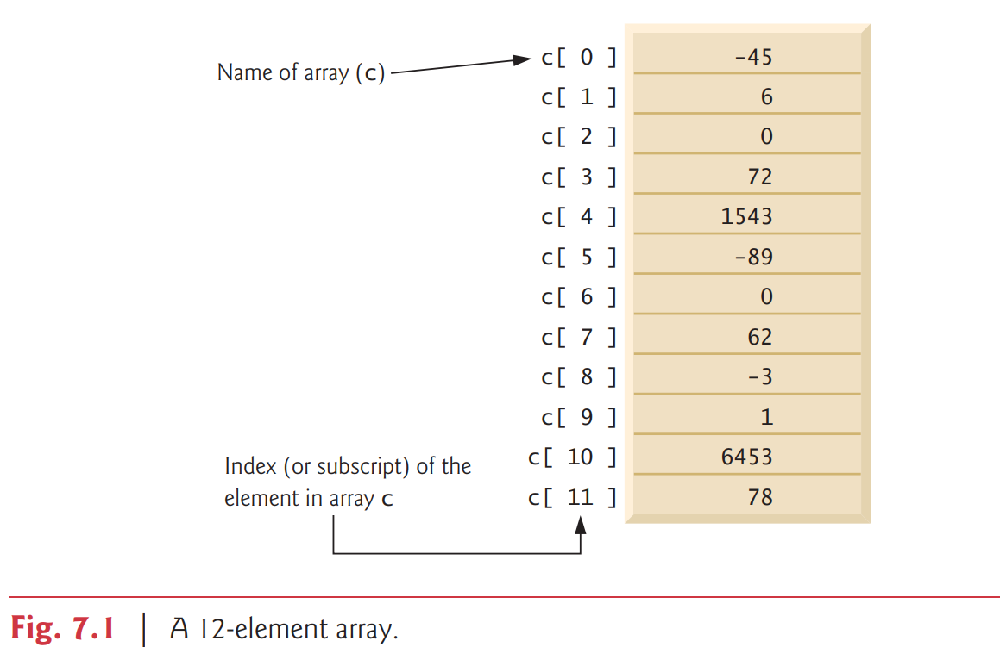

# 7.2 Arrays

An array is a group of variables (called elements or components) containing values that all have the **same type**. 

- array 是一群 有相同 data type 的 elements

Arrays are objects, so they’re considered reference types. 

arrays 是 objecys, 他們是 reference types

As you’ll soon see, what we typically think of as an array is actually a reference to an array object in memory. 

- an array = a reference to an array object

The elements of an array can be either primitive types or reference types (including arrays, as we’ll see in Section 7.11). 

- the elements 可以是 primitive types or references types

To refer to a particular element in an array, we specify the name of the reference to the array and the position number of the element in the array. 

- 指出特定裡面的 element, 我們會指定 the name of reference 還有 position number

The position number of the element is called the element’s ```index``` or ```subscript```

- the position # 被叫做 `index` or `subscript`

### Logical Array Representation

Figure 7.1 shows a logical representation of an integer array called c. 

This array contains 12 elements. 

A program refers to any one of these elements with an array-access expression
that includes the name of the array followed by the index of the particular element in
square brackets ([]). 

The first element in every array has index zero and is sometimes called the zeroth element. 

Thus, the elements of array c are ```c[0], c[1], c[2]``` and so on.

The highest index in array c is 11, which is 1 less than 12 — the number of elements in the array. 

Array names follow the same conventions as other variable names.



**An index must be a nonnegative integer**. 

- index 一定要是 0 或正整數

A program can use **an expression** as an index.

- 可以使用 expression as an index

For example, if we assume that variable a is 5 and variable b is 6, then the statement

```
c[a + b] += 2;
```

#### Common Programming Error 7.1
An index must be an `int` value or a value of a type that can be promoted to int — namely,
`byte`, `short` or `char`, but **not long**; otherwise, a compilation error occurs

- index : 
  1. int
  2. byte
  3. short
  4. char 
  - 只能包含這 4 種 data type, 要不然會有 compilation error


Let’s examine array c in Fig. 7.1 more closely. 

The name of the array is c. 

Every array object knows its own length and stores it in a length instance variable. 

The expression ```c.length``` returns array c’s length. 

Even though the length instance variable of an array is public, it cannot be changed because it’s a ```final``` variable. 

- 雖然 length 是 public 但是長度無法改變因為有 `final`

This array’s 12 elements are referred to as ```c[0], c[1], c[2], …, c[11]. ```

The value of ```c[0]``` is -45, the value of ```c[1]``` is 6, the value of ```c[2]``` is 0, the value of ```c[7]``` is 62 and the value of ```c[11]``` is 78. 

To calculate the sum of the values contained in the first three elements of array c and store the result in variable sum, we would write

```
sum = c[0] + c[1] + c[2];
```

To divide the value of ```c[6]``` by 2 and assign the result to the variable x, we would write

```
x = c[6] / 2;
```
