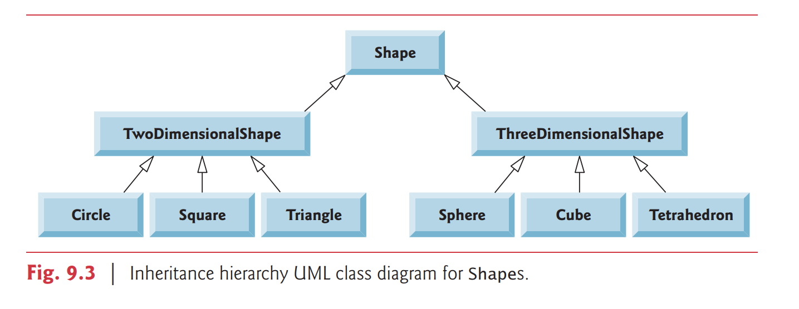

# 9.2 Superclasses and Subclasses

Often, an object of one class is an object of another class as well. 

For example, a `CarLoan` is a Loan as are `HomeImprovementLoans` and `MortgageLoans`. 
Thus, in Java, class `CarLoan` can be said to inherit from class Loan. 

In this context, class `Loan` is a superclass and class
`CarLoan` is a subclass. 

A `CarLoan` is a specific type of `Loan`, but it’s incorrect to claim that
every `Loan` is a `CarLoan` — the `Loan` could be any type of loan. 

Figure 9.1 lists several simple examples of superclasses and subclasses — superclasses tend to be “more general” and subclasses “more specific.”

Superclass | Subclasses
-----------|-------------
Student |   GraduateStudent UndergraduateStudent
Shape | Circle, Triangle, Rectangle, Sphere, Cube
Loan| CarLoan, HomeImprovementLoan, MortgageLoan
Employee |Faculty, Staff
BankAccount| CheckingAccount, SavingsAccount

Because every subclass object is an object of its superclass, and one superclass can have
many subclasses, the set of objects represented by a superclass is often larger than the set
of objects represented by any of its subclasses. 

- 因為每一個 subclass object is an object of its superclass
- 一個 superclass 可以有很多 subclasses
- 所以 the set of objects in a superclass 會大於 the set of object in an subclasses

For example, the superclass Vehicle represents all vehicles, including cars, trucks, boats, bicycles and so on. 

By contrast, subclass Car represents a smaller, more specific subset of vehicles.

### Shape Hierarchy
Now consider the Shape inheritance hierarchy in Fig. 9.3. 

This hierarchy begins with superclass Shape, which is extended by subclasses `TwoDimensionalShape` and `ThreeDimensionalShape` — Shapes are either `TwoDimensionalShapes` or `ThreeDimensionalShapes`.

The third level of this hierarchy contains specific types of `TwoDimensionalShapes` and
`ThreeDimensionalShapes`. 

As in Fig. 9.2, we can follow the arrows from the bottom of the
diagram to the topmost superclass in this class hierarchy to identify several is-a relationships. 

For example, a Triangle is a `TwoDimensionalShape` and is a `Shape`, while a `Sphere`
is a `ThreeDimensionalShape` and is a Shape. 

This hierarchy could contain many other classes. 

For example, `ellipses` and `trapezoids` also are `TwoDimensionalShapes`.

Not every class relationship is an inheritance relationship. 

- 並不是每一個 class relationship 都是繼承的關係

In Chapter 8, we discussed the `has-a` relationship, in which classes have members that are references to objects of other classes. 

- `has-a` : 表示 classes 有 members 是一個 references to objects of another classes

Such relationships create classes by composition of existing classes. 

For example, given the classes `Employee`, `BirthDate` and `TelephoneNumber`, it’s improper to say that an `Employee` is a `BirthDate` or that an `Employee` is a `TelephoneNumber`. 

However, an `Employee` has a `BirthDate`, and an `Employee` has a `TelephoneNumber`.

It’s possible to treat superclass objects and subclass objects similarly—their commonalities are expressed in the superclass’s members. 

Objects of all classes that extend a common superclass can be treated as objects of that superclass—such objects have an `is-a` relationship with the superclass. 

- is-a : object of all classes 是 extend a common supperclass and 是 be treated as objects

Later in this chapter and in Chapter 10, we consider
many examples that take advantage of the `is-a` relationship.

A subclass can customize methods that it inherits from its superclass. 

- a subclass 可以 customize methods 是繼承從 supeclass

To do this, the subclass overrides (redefines) the superclass method with an appropriate implementation, as we’ll see in the chapter’s code examples.

- 這樣做, subclass override the supperclass method 用 implementation